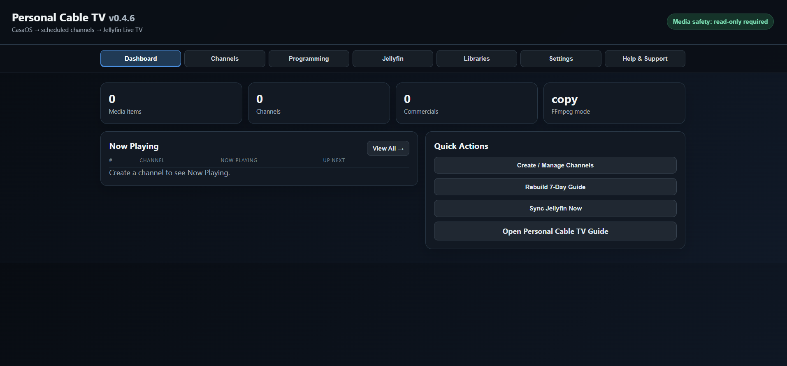
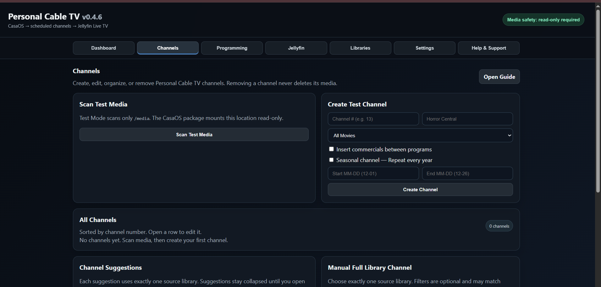
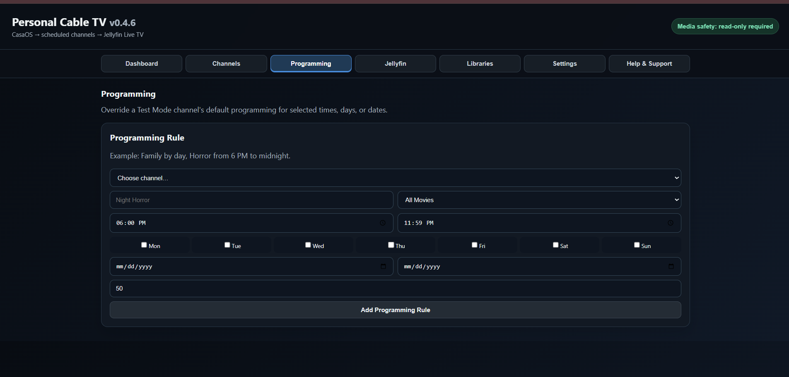
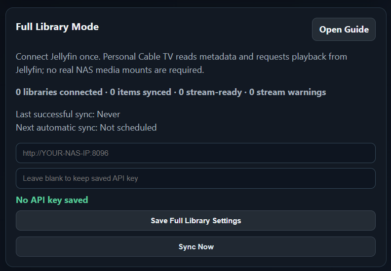
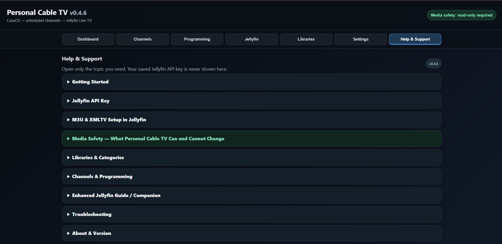

# Personal Cable TV

Personal Cable TV turns a Jellyfin library into scheduled, linear cable-style Live TV channels.

Current public version: **v0.4.6**

## What it looks like

### Dashboard

### Channels

### Programming

### Jellyfin Full Library Mode

### Help & Support

## Easy CasaOS install

1. Download `casaos/docker-compose.yml` from this repository.
2. In CasaOS, choose **Install a customized app**.
3. Choose **Docker Compose** and upload the file.
4. Change the host media folder to the folder that contains your media if needed.
5. Keep the container media path as `/media` and keep media read-only.
6. Click **Install**.
7. Open Personal Cable TV from the CasaOS dashboard.

The installer uses the prebuilt public Docker image:

`ghcr.io/akaidragon123k/personal-cable-tv:0.4.6`

## Jellyfin connection

Personal Cable TV can connect to Jellyfin using your Jellyfin server address and a Jellyfin API key. Do not publish or commit your API key to GitHub.

## Media safety

Personal Cable TV is designed to treat mounted media as read-only. It should never delete, rename, move, or overwrite your real NAS media.
