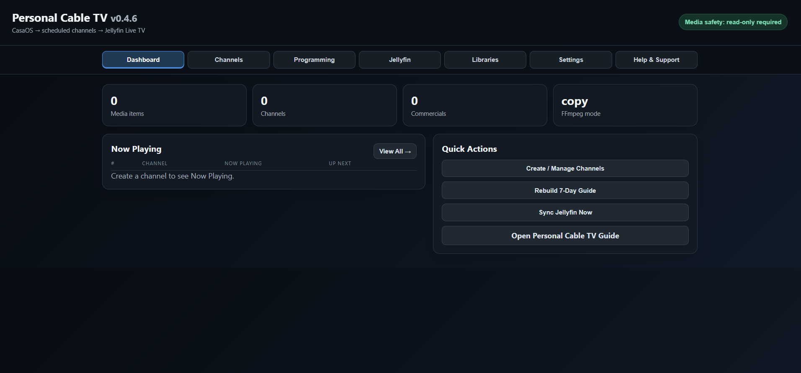
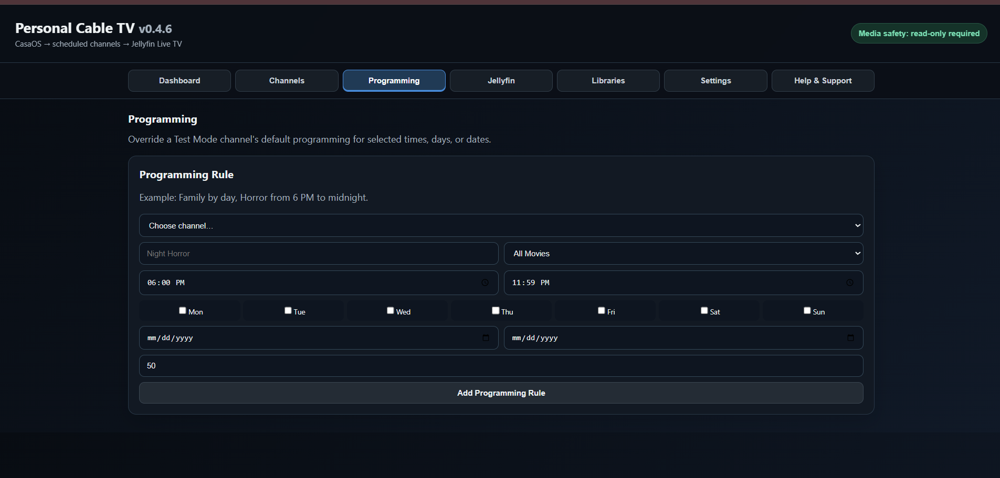
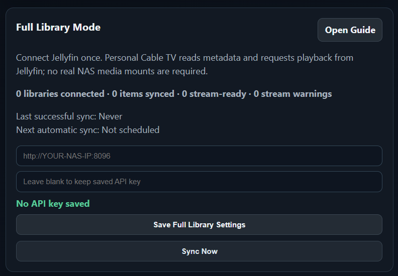
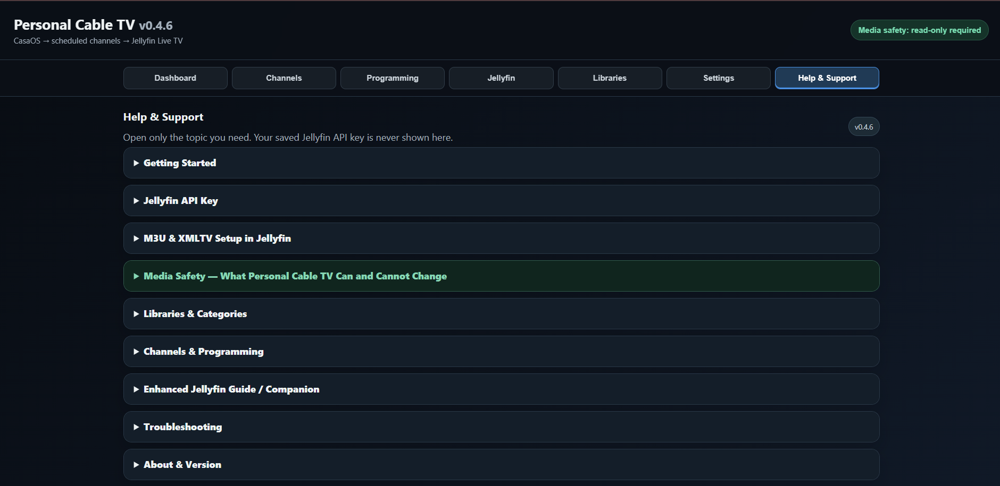

# Personal Cable TV

Personal Cable TV turns a Jellyfin media library into scheduled, linear cable-style Live TV channels that you control on your own server or NAS.

> **Media is not included.** Personal Cable TV does not provide movies, TV shows, cartoons, anime, channels, or subscription content. You must supply your own legally obtained media files and have permission to use them.

## Current public GitHub version

**v0.4.7**

Public Docker image:

`ghcr.io/akaidragon123k/personal-cable-tv:0.4.7`

## What you need

- A server, NAS, or computer capable of running Docker / Docker Compose
- A Jellyfin server with your own media library
- Your own legally obtained media files
- Network access between Personal Cable TV and Jellyfin
- A Jellyfin API key for the Personal Cable TV server connection
- Port **8484** available by default for the Personal Cable TV web interface

Personal Cable TV is self-hosted. It is not a hosted streaming service and does not provide copyrighted media.

## What Personal Cable TV does

- Creates scheduled, linear cable-style channels from your Jellyfin library
- Generates **M3U** tuner data for Jellyfin Live TV
- Generates **XMLTV** guide data
- Provides a web dashboard for channel management and programming
- Plays the program that is currently scheduled rather than behaving like normal on-demand playback
- Keeps mounted media read-only when installed as documented

## Optional Jellyfin Companion

The Jellyfin Companion is maintained in its own repository so installation and updates are easier to find and manage.

If you want the custom Personal Cable TV experience inside Jellyfin — including the custom Guide, On Now experience, verified LG/webOS channel surfing, and cable-style playback controls — use:

https://github.com/akaidragon123k/PersonalCableTV-Jellyfin-Companion

The Companion repository includes:

- Jellyfin repository installation instructions
- Current Companion release
- Revision history and changelog
- Compatibility notes
- Direct Jellyfin plugin update support

This main repository is for the **Personal Cable TV server**. It is no longer the download location for current Jellyfin Companion releases.

## Roku companion app

A separate **P.Cable TV Companion** Roku app is being prepared for Roku distribution. It requires a Personal Cable TV server and does not include media. Roku users should follow the Roku app's own listing and setup instructions when it becomes publicly available.

## What it looks like

### Dashboard

### Programming

### Jellyfin Full Library Mode

### Help & Support

## Easy CasaOS install

1. Download `casaos/docker-compose.yml` from this repository.
2. In CasaOS, choose **Install a customized app**.
3. Choose **Docker Compose** and upload the file.
4. Change the host media folder if needed.
5. Keep the container media path as `/media` and keep media read-only.
6. Click **Install**.
7. Open Personal Cable TV from the CasaOS dashboard.

The current public installer uses:

`ghcr.io/akaidragon123k/personal-cable-tv:0.4.7`

### Default paths in the example Compose file

- App data: `/DATA/AppData/personal-cable-tv/data`
- Media: `/DATA/Media/PersonalCableTV`
- Container media path: `/media`
- Web port: `8484`

Change the host paths to match your own NAS/server if needed. Do not change the container media path unless you also update the application configuration accordingly.

## Jellyfin connection

Personal Cable TV connects to Jellyfin using your Jellyfin server address and a Jellyfin API key.

**Do not publish or commit your Jellyfin API key to GitHub.**

After connecting and syncing your Jellyfin libraries, Personal Cable TV provides the two URLs Jellyfin needs for Live TV:

- **M3U tuner:** Jellyfin Dashboard → Live TV → Tuner Devices → Add Tuner Device → M3U Tuner
- **XMLTV guide:** Jellyfin Dashboard → Live TV → TV Guide Data Providers → Add → XMLTV

After saving both in Jellyfin, use **Refresh Guide Data**, then open **Live TV → Guide** to confirm that channels and schedules appear.

## Media safety

Personal Cable TV is designed to treat mounted media as read-only. It should never delete, rename, move, or overwrite your real NAS media when installed as documented.

Keep backups of important server configuration and media, and verify your Docker volume mappings before starting the container.

## Privacy, terms, and Roku companion documents

The `PRIVACY.md` and `TERMS.md` files in this repository currently document the **P.Cable TV Companion Roku app** because Roku requires public policy URLs for the app listing. They do not mean that the main Personal Cable TV server includes media or a Roku subscription service.

## Support

Use GitHub Issues for public bug reports and feature requests. Do not post API keys, passwords, access tokens, private server addresses, or copyrighted media files in an issue.
